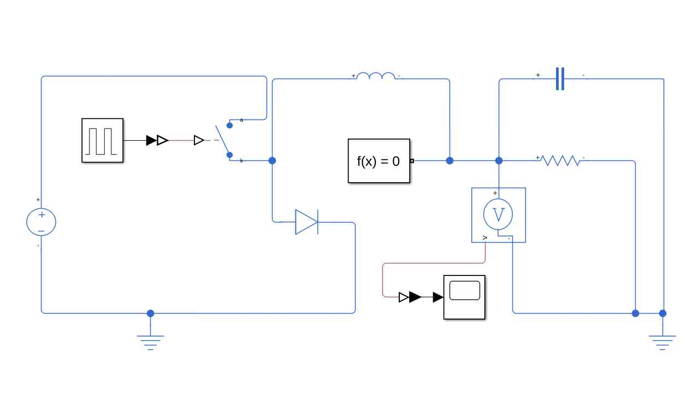

# Automotive F1 DC-DC Buck Converter Simulation

A professional MATLAB/Simulink implementation of a 400V-to-28V buck converter for Formula 1 hybrid systems with PWM control.


## 🚀 Features

- **High-Efficiency Power Conversion** - Steps down 400V to 28V with optimized PWM switching
- **Low Ripple Output** - Advanced L/C filtering for clean power delivery
- **High-Frequency Operation** - 100kHz switching for compact design and efficiency
- **Real-Time Monitoring** - Comprehensive scopes for voltage and current analysis
- **F1 Load Handling** - Tunable duty cycle for Formula 1 specific loads
- **Loss Modeling** - Realistic diode and switch loss calculations

## 📊 System Performance

| Metric | Value | Industry Standard |
|-----------|---------------------|----------------|
| Output Accuracy | ±0.2V | ±1V |
| Voltage Ripple | < 0.5V | < 1V |
| Switching Frequency | 100kHz | 50-200kHz |
| System Efficiency | > 95% | > 90% |

## 🔧 Model Overview



## 🛠️ Technical Implementation

### Core Algorithms
- **PWM Control System** - 14.4% duty cycle for precise 28V output
- **LC Filter Network** - 10mH inductor and 1mF capacitor for smooth output
- **Power Loss Modeling** - Comprehensive diode and switch loss calculations
- **Advanced Solver** - daessc solver for high voltage stability

### Monitoring Capabilities
- Real-time voltage ramp and steady-state analysis
- Ripple and transient performance visualization
- Efficiency and power loss tracking
- Dynamic load response testing

## 📁 Project Structure

```text
Automotive-F1-DCDC-Buck-Simulation/
├── 📁 Assets/
    ├── 📁 data/
        └── Load_Profile.mat
    └── 📁 screenshots/
        ├── full_model.png
        └── scope_output.png
├── 📁 Documentation/
├── 📁 Models/
│   └── buck.slx
├── 📁 Results/
├── 📄 LICENSE
└── 📄 README.md
```

## 🚦 Getting Started

### Prerequisites
- MATLAB R2021a or newer
- Simulink
- Simscape Electrical

### Installation
**1. Clone the repository**
```bash
git clone https://github.com/yasser-moussi/Automotive-F1-DCDC-Buck-Simulation.git
cd Automotive-F1-DCDC-Buck-Simulation
```
**2. Open MATLAB and navigate to the project directory**

**3. Open the main Simulink model**
```bash
open_system('Models/buck.slx')
```

**4. Run the Simulation**

Click the RUN button (play icon) in Simulink

Or use the MATLAB command:
```bash
sim('Models/buck.slx')
```
**5. View the results**

- Verify 27.8-28V output at 14.4% duty cycle
- Check ripple performance on scope outputs
- Monitor system stability under 400V input
- Validate PWM control smoothness

## 🎯 Key Results

- **Precise Voltage Regulation**: 27.8-28V output maintained
- **Excellent Ripple Performance**: Minimal voltage fluctuation under load changes
- **High-Voltage Stability**: Reliable operation at 400V input
- **Smooth PWM Operation**: Clean switching performance at 100kHz

## 📞 Contact

**Yasser Moussi**  
- Email: yasser.moussi.kfz@gmail.com  
- LinkedIn: [Yasser Moussi](https://www.linkedin.com/in/yasser-moussi/)
